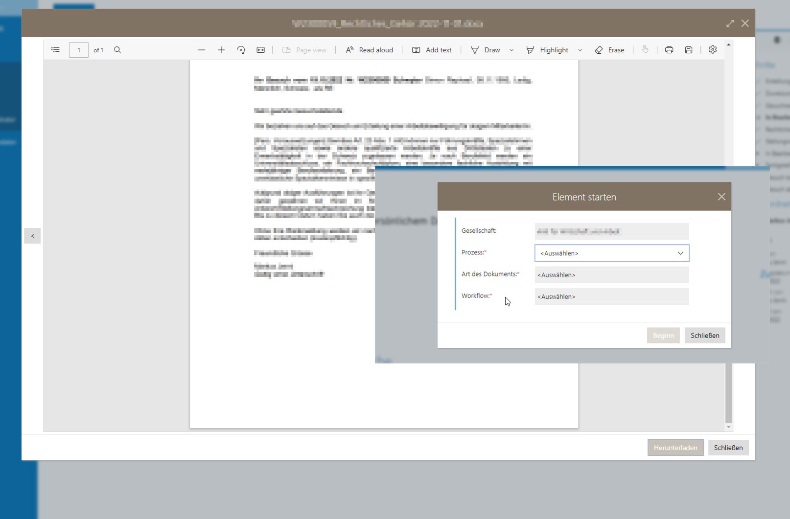
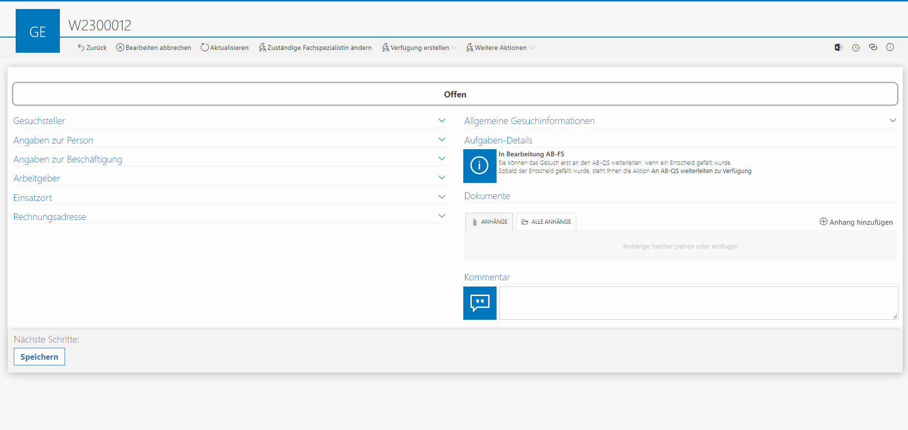
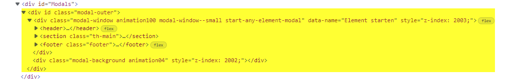
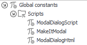
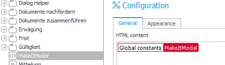
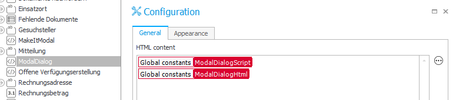
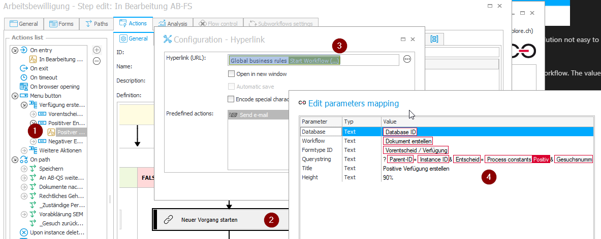

# Enhance User Experience with Modal Dialogs

## Introduction

During the requirements and specification phase of one of our largest WEBCON BPS project, our requirement engineer came to us with a lot of challenges. He was used to writing specifications for custom web applications and because he was new to WEBCON BPS he wasn’t always aware of limitations. However, sometimes we need to leave our comfort zone and push our limits to a higher level.

One of the key challenges were the usage of modal dialogs. Modal dialogs would allow gathering data and perform an action when completing the dialog. They would also allow to close the dialog without performing an action. They should be able to be started by menu actions and/or path transitions.
Modal Dialogs are already used by WEBCON BPS, e.g. preview of documents and displaying alerts. WEBCON BPS even allows setting values on path transitions, but only in conjunction with reports and mass actions. 




Our scripts are using the existing functionality to display a modal dialog. Basically we start a new workflow in embedded mode and apply some CSS to hide form elements that disturb the look and feel of a modal dialog. In the most simple case the workflow only has a start, a path transition and a finish step. 


In more complex cases you can for example pause the dialog and continue later, or your dialog works as a wizard. For our cases, the workflow usually updates data of the calling element and performs the required action. The action could be a setting certain values followed with a path transition, the creation of a document or whatever you need. 
In most of our cases we don't need the workflow instance of the dialog. When we finish the dialog workflow, we delete the instance with the archiving functionality.



## How WEBCON BPS dialogs work

A little research showed, that showing content as a modal dialog is actually quite simple. 
There is a div-element (id="Modals"), which hosts the content to display. 


To make use of this already existing functionality, you only need create the content you want to display and move/copy into the div-element **Modals** as a child element. As soon as the Modals-div contains content, this content will be displayed in a modal dialog. To close the dialog, you just remove the content.  

This is the HTML template we use for our dialogs.
```Html
	<div class="modal-outer">
		<div class="modal-window animation100 modal-window--large attachment-preview-modal" style="z-index: 2003;">
			<header>
				<div class="title-container expandable">
					<div class="title" id="nxModalTitle"></div>
					<div class="subtitle"></div>
				</div>
				<div class="actions">
					<div class="close">
						<button type="button" class="icon-button no-text no-hover no-background" tabindex="0" aria-label="Schließen">
							<i class="icon ms-Icon ms-Icon--ChromeClose ms-Icon--standard" aria-hidden="true" data-disabled="false" title=""></i>
						</button>
					</div>
				</div>
			</header>
			<iframe id="iframe" height="100%"></iframe>
		</div>
		<div class="modal-background animation04" style="z-index: 2002;"></div>
	</div>
```
If you copy this content and paste it inside the Modals-div when you are in developer mode, a modal dialog will be showed.

That's all about the basics

## What needs to be done

### Provide a set of global variables
In order to open a dialog, we provide the following artifacts as global constants.  
**Please keep in mind that currently the maximum length of 2000 characters!**  
When extending the script, you might run in problem related to this length restriction. Which could be solved by shortening the script, but it would be less readable, and you definitely need to keep the script in a repository. 
Which would be a good approach anyway.  

  

- **ModalDialogScript:**  
  JavaScript that deals with opening and closing dialogs  
  In your case we also can open a created Word document in edit-mode.  
  This JavaScript needs to be added to an HTML field on the element opening the dialog. 
  
  Copy the content of the file [Scripts/ModalDialog.txt](./Scripts/ModalDialog.txt) into the constant.  
  The code provides to functions:
 
  ```JavaScript
  nxbps.modal.openUrl('Title', 'url', height);
  
  e.g.
  nxbps.modal.openUrl('Title', '/embed/form/db/1/element/123/form/edit?Att1=123', 80%)	
  nxbps.modal.openUrl('Title', '/embed/form/db/1/element/123/form/edit?Att1=123', 80%)
  ```
  and
  ```JavaScript
  nxbps.modal.closeDlg(closeAction, param1, param2)
 
  e.g.
  nxbps.modal.closeDlg(nxbps.modal.dlgCloseOptions.close)
  
  // using param1 as elementId and param2 as attachmentId
  nxbps.modal.closeDlg(nxbps.modal.dlgCloseOptions.closeEdit, 1234, 2334)
  
  ```
  
  
- **ModalDialogHtml:**  
  HTML template to host the content  
  We use the same header as WEBCON BPS does. In order to display the form we are using an iframe. 
  Copy the content of the file [Scripts/ModalDialogHtml.txt](./Scripts/ModalDialogHtml.txt) into the constant.  
 
  This needs to be added in an HTML field on the element opening the dialog. It makes sense to use the same HTML field as for the JavaScript
- **MakeItModal:**  
  More JavaScript to do some UI adjustments in the modal dialog  
  We strip the header of the form and also the side panel.  
  In addition, we add a back-button, which simply closes the dialog without executing an action  
   Copy the content of the file [Scripts/MakeItModal.txt](./Scripts/MakeItModal.txt.txt) into the constant.  
 
We also create a set of business rules to start a workflow and show an existing element as a modal dialog  
It is a much better way to provide business rules with proper parameters than creating the JavaScript manually every time  

  

Unfortunately sharing business rules are, apart from import/export a solution not easy to share. So we just outline what the business rules are doing.    

- **Open workflow**  
  Builds a string that can be used in a hyperlink action to open a workflow. The values in the curly brackets are parameters of the business rule
  ```
  javascript:nxbps.modal.openUrl('{Title}', '/embed/form/db/{DbId}/start/wf/{WfId}/dt/{FormId}/form{QueryString}', {Height})
  ```
- **Start Workflow**  
  Builds a string that can be used in a hyperlink action to start a workflow. The values in the curly brackets are parameters of the business rule
  ```
  javascript:nxbps.modal.openUrl('{Title}', '/embed/form/db/{DbId}/element/{WfId}/form/edit{QueryString}', {Height})
  ```
## Scenarios

The provided artifacts work very nicely when used in menu actions, but not yet on path transitions. There is some work to be done, 

### Dialog to collect and set some data

#### Create helper Workflow

- Create your dialog helper workflow  
  The most simple dialog workflow has a start step, one path and the end step. 
- Add an HTML field  
  Add an HTML field with the global constant MakeItModal.  
  
- Other fields  
  Apart from the fields to be displayed we usually have some technical fields to save the calling element and if used, the path to be executed at the end of the dialog.
- Implement the action to execute  
  Whether you use the same workflow with different forms and execute the actions depending on the used form or you use multiple workflows with one action is up to you.
  Important is, that you close the dialog after the last action. We used an **On entry** action in the final step. In our case we also checked whether there was a document generated or not.
  
  You have to keep in mind, that the form in the modal dialog is displayed as an iframe. In order to close the dialog you need to access the parent.
  ```Javascript
   javascript:parent.nxbps.modal.closeDlg();
  ```

#### Implement menu- action
- Add an HTML field to the main form and add the Modal-Dialog-Script and the Modal-Dialog-HTML template as content
  
- Create a Menu button  
  Add a hyperlink action and use the business rule **Start Workflow**
  Use the global Start-Dialog business rule and provide the proper parameters  
  
- Save it and use it :)


### Dialog to generate a document

Using the same concepts we can also gather data, write them to the calling instance and create a Word document. As the standard **create/update word document** action only works for the current element, we created a custom SDK action. This SDK action allows us to create a document from any instance. This is specially useful, because we can handle the whole document generation in our dialog. Otherwise, we would have to use path transitions on the main element.

### Other dialogs

Based on the principles above you can implement any other dialog you would like to. Just some ideas:
- Multistep Wizard
- Save and continue
- Starting sub workflows
- Opening sub workflows
- .....


### Know limitations

The artifacts are provided as they are. There are some limitations that might need to be handled depending on your use case.
- no translation for the back button
- no translations for the Title of the dialog
- no support to be used on path transition

