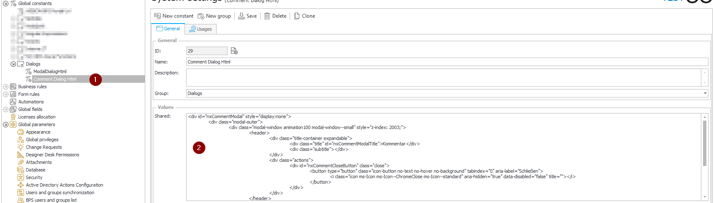
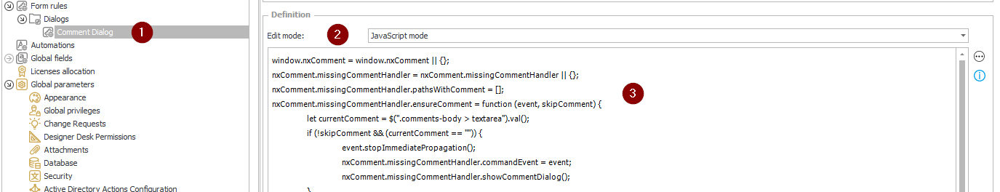
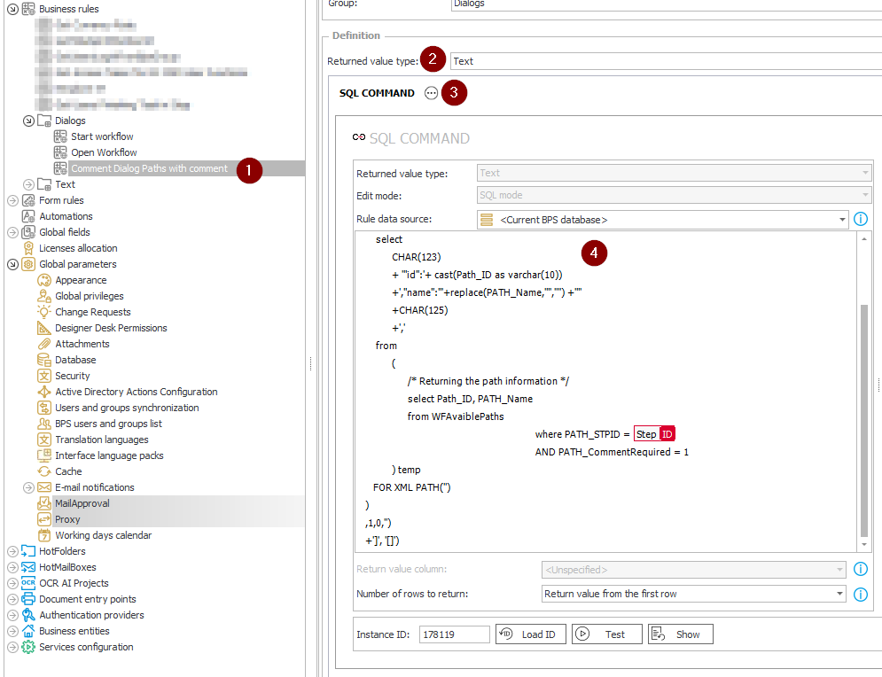
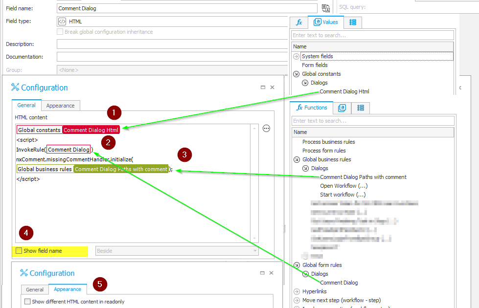

# Improving the user experience for required comments

## Introduction
I don't think I'm the only one getting annoyed by the ugly validation error message **Comment is required on path: ....**.  
So, let's improve the user experience by showing a WEBCON BPS style modal dialog when a comment is required.  

  

## How is it done  
The solution consists of the following components:

- Global constant  
the html used for the dialog
- Global form rule  
The javascript used to handle missing comments  
**Why a form rule?** There is a limit of 2000 characters when using constants, so we are more flexible by using a form rule.
- Global business rule  
Whether a comment is required on a path can be retrieved from the database. 
- Html field


### Global constant
Create a global constant (1) and insert the content 
from [snippets/CommentDialog.html](./Snippets/CommentDialog.html) (2).
```
Name: 
Missing Comment Html

Description: 
Html used to display a modal dialog to enter a comment
```

  

### Global form rule
Create a global form rule (1), switch the edit mode to **JavaScript mode** (2) and insert the script [snippets/CommentDialog.js](./Snippets/CommentDialog.js) (3). 
```
Name: 
Missing Comment 

Description: 
Javascript implementing the functionality to cope with required comments
```
 

### Global business rule
Create a global business rule (1), set the return value to Text (2) and add a **SQL Command** (3). Configure the SQL Command by inserting the Sql statement [snippets/PathWithComments.sql](./Snippets/PathWithComments.sql) (3). 
```
Name: 
Paths with required comment

Description: 
Returns a list with the id of all paths requiring a comment
```

 

Unfortunately, the validation is done server-side, so we need to get hold of the paths requiring a comment. This is done by this business rule, which returns a list of path elements requiring a comment or an empty array.
```
[{"id":64,"name":"....."},{"id":65,"name":"....."},]
```

### Html field
To use the functionality on your form, add a Html field to your process. 
As Html content add the html from the global constant (1), add the script tags and the business rule (2) and initialize with the paths from the global business rule (3).
Feel free to use either the snippet below and replace the id with yours or select the constant, form and business rule from the expression editor.

```
#{EGV:29}#
<script>
InvokeRule(#{BRUX:4334:ID}#)
nxComment.missingCommentHandler.initialize(#{BRD:4318}#);
</script>
```

 

Don't forget to hide the field name (4). If the configured html is also available in edit mode, the comment dialog also works when a comment is required on a quick path.

Make it available on all the steps where you need the functionality and give it try!

## How it works

The initialize function adds a click event handler to all path buttons requiring a comment. 
When the path button is pressed, the registered handler checks whether there is a missing comment or not. Only on a missing comment, the dialog is shown.  
The textarea receives the focus and you can start type in the comment. By simply closing the dialog or continue without comment, the path execution is stopped. So there is no error message shown.  
After entering the comment you can either press the continue button or use tab then return key to close the dialog and continue the path execution.

By the way, it works for WEBCON BPS 2022 (jQuery) and 2023 (cash).